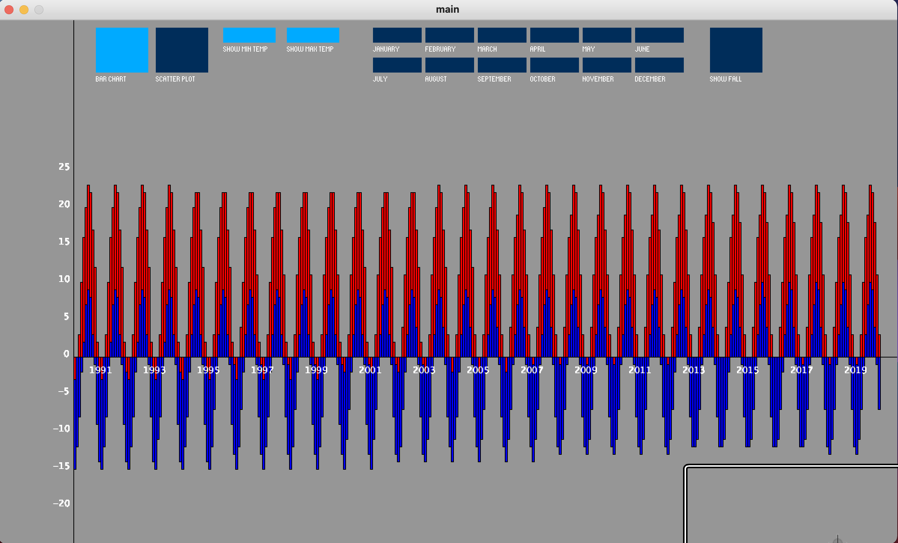

# Weather Data Application
This project aims to provide introductory experience with designing and developing a project. Some concepts which were explored include Object Oriented Programming (OOP), File I/O, and the use of the GUI library. This application specifically is a Weather Data Application, it uses the GUI library and File I/O to read weather data from a .csv file and display it on an animated graph.

## Usage
Run main.pde using the Processing 3 Integrated Development Environment.

## Preview

